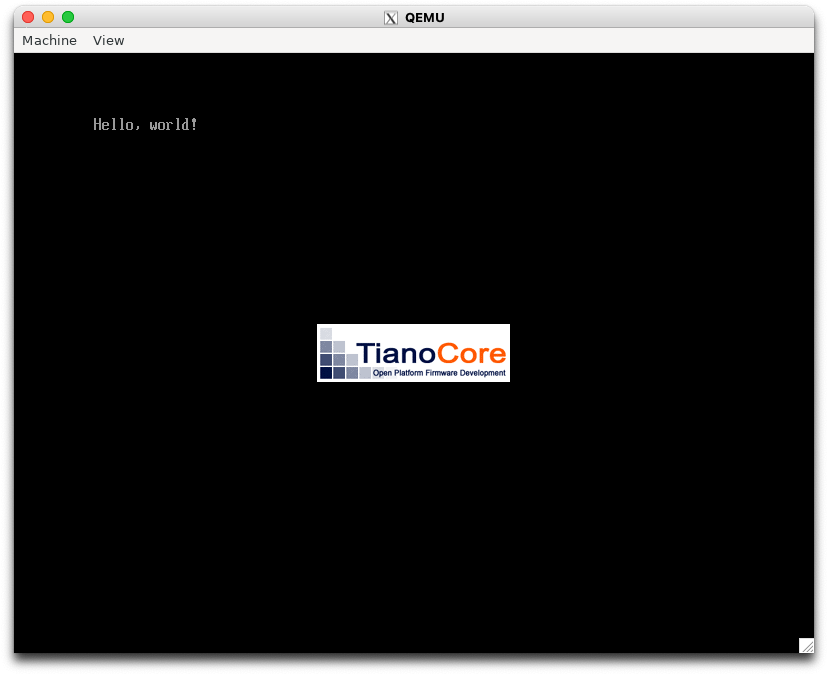

# 1.4 エミュレータでのやり方

- ディスクイメージの作成

```console
$ qemu-img create -f raw disk.img 200M
$ mkfs.fat -n 'MIKAN OS' -s 2 -f -R 32 -F 32 disk.img
$ mkdir -p mnt
$ sudo mount -o loop disk.img mnt
$ sudo mkdir -p mnt/EIF/BOOT
$ sudo cp BOOTX64.EFI mnt/EFI/BOOT/BOOTX64.EFI
$ sudo umount mnt
```

- ディスクイメージを QEMU で起動

```console
$ qemu-system-x86_64 \
    -drive if=pflash,file=$HOME/osbook/devenv/OVMF_CODE.fd \
    -drive if=pflash,file=$HOME/osbook/devenv/OVMF_VARS.fd \
    -hdadisk.img
```

この一連の処理をまとめたスクリプトが用意されている。

```console
$ $HOME/osbook/devenv/run_qemu.sh BOOTX64.EFI
```



# 1.9 C言語でハローワールド

clang で COFF 形式のオブジェクトファイルを出力し、lld-link で UEFI 用の PE ファイルを出力する。

```console
$ clang -target x86_64-pc-win32-coff -mno-red-zone -fno-stack-protector -fshort-wchar -Wall -c hello.c
$ lld-link /subsystem:efi_application /entry:EfiMain /out:hello.efi hello.o
```

C言語のソースファイルから生成された実行ファイルで起動可能、表示する文字は少し変えた

```console
$ $HOME/osbook/devenv/run_qemu.sh hello.efi
```


