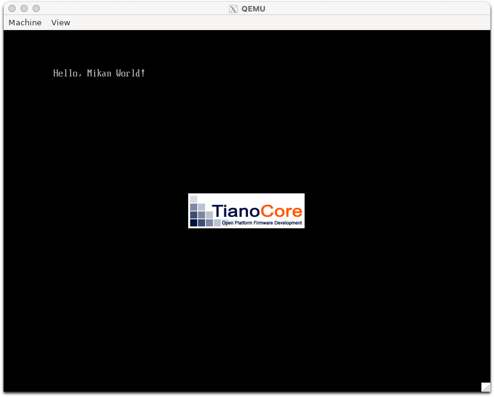

# 2.2 EDK IIでハローワールド (osbook_day02a)

- day02a バージョンを準備

```console
$ cd $HOME/workspace/mikanos
$ git checkout osbook_day02a
```

- シンボリックリンクを貼って、 edk2 から参照

```console
$ cd $HOME/edk2
$ ln -s $HOME/workspace/mikanos/MikanLoaderPkg ./
```

- セットアップ読み込み

```console
source edksetup.sh
Using EDK2 in-source Basetools
WORKSPACE: /home/vscode/edk2
EDK_TOOLS_PATH: /home/vscode/edk2/BaseTools
CONF_PATH: /home/vscode/edk2/Conf
Copying $EDK_TOOLS_PATH/Conf/build_rule.template
     to /home/vscode/edk2/Conf/build_rule.txt
Copying $EDK_TOOLS_PATH/Conf/tools_def.template
     to /home/vscode/edk2/Conf/tools_def.txt
Copying $EDK_TOOLS_PATH/Conf/target.template
     to /home/vscode/edk2/Conf/target.txt
```

- ビルド設定 (`Conf/target.txt`) を書き換えて MikanLoaderPkg をビルド対象に設定

| 設定項目 | 設定値 |
| --- | --- |
| ACTIVE_PLATFORM | MikanLoaderPkg/MikanLoaderPkg.dsc |
| TARGET | DEBUG |
| TARGET_ARCH | X64 |
| TOOL_CHAIN_TAG | CLANG38 |

- ビルド

```console
$ cd $HOME/edk2
$ build
```

エラーが発生

```console
/home/vscode/edk2/MikanLoaderPkg/MikanLoaderPkg.dsc(...): error 4000: Instance of library class [RegisterFilterLib] is not found
        in [/home/vscode/edk2/MdePkg/Library/BaseLib/BaseLib.inf] [X64]
        consumed by module [/home/vscode/edk2/MikanLoaderPkg/Loader.inf]


- Failed -
```

同様のエラーレポート[ブートローダーのビルド #6](https://github.com/uchan-nos/mikanos-build/issues/6)を見つけたので同様に変更

```diff
diff --git a/MikanLoaderPkg/MikanLoaderPkg.dsc b/MikanLoaderPkg/MikanLoaderPkg.dsc
index c6db36b..650a3ea 100644
--- a/MikanLoaderPkg/MikanLoaderPkg.dsc
+++ b/MikanLoaderPkg/MikanLoaderPkg.dsc
@@ -24,6 +24,7 @@
   PrintLib|MdePkg/Library/BasePrintLib/BasePrintLib.inf
   UefiBootServicesTableLib|MdePkg/Library/UefiBootServicesTableLib/UefiBootServicesTableLib.inf
   UefiRuntimeServicesTableLib|MdePkg/Library/UefiRuntimeServicesTableLib/UefiRuntimeServicesTableLib.inf
+  RegisterFilterLib|MdePkg/Library/RegisterFilterLibNull/RegisterFilterLibNull.inf

 #@range_begin(components)
 [Components]
```

- 再度ビルドすると成功

```console
$ build
...

- Done -
Build end time: 12:38:00, Dec.12 2024
Build total time: 00:00:01

```

何度か起動し直したり、起動後にしばらく待つと表示される。



# 2.7 メモリマップのファイルへの保存

```console
$ cd $HOME/workspace/mikanos
$ git checkout osbook_day02b
$ cd $HOME/edk2
$ source edksetup.sh
$ build
```

```console
$ $HOME/osbook/devenv/run_qemu.sh Build/MikanLoaderX64/DEBUG_CLANG38/X64/Loader.efi
```

```console
$ mkdir -p mnt
$ sudo mount -o loop disk.img mnt
$ ls mnt
$ cat mnt/memmap
$ sudo umount mnt
```
