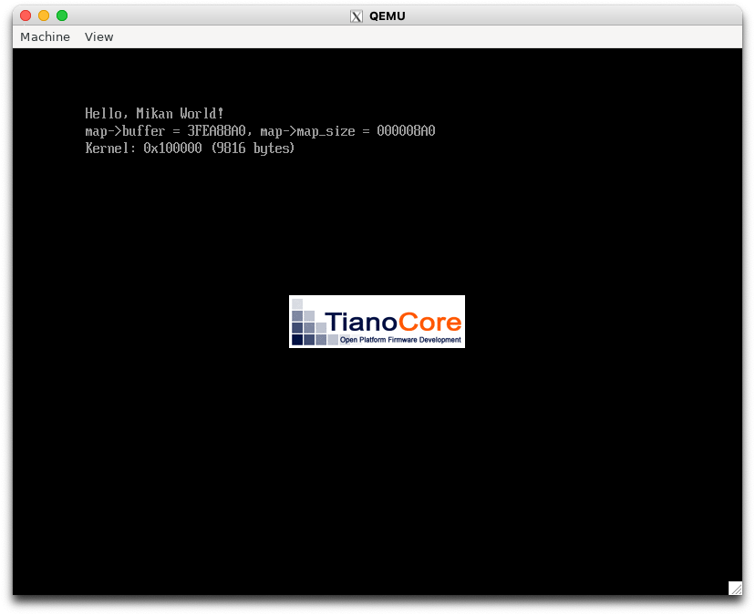
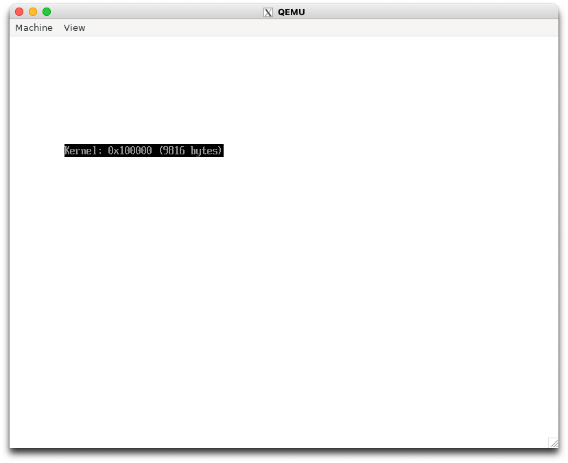
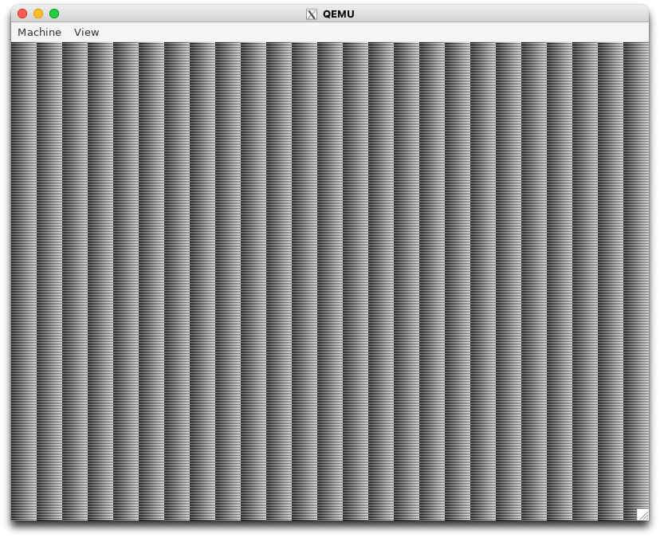

# 3.1 QEMU モニタ

- info registers コマンド: CPU の各レジスタの現在の値を表示する

```console
(qemu) info registers

CPU#0
RAX=0000000000000000 RBX=0000000000000000 RCX=000000000000000d RDX=0000000000000015
RSI=000000003fec93d0 RDI=000000003e78d1c0 RBP=000000003e78d1c8 RSP=000000003feaca80
R8 =00000000000000af R9 =0000000000000018 R10=0000000000000050 R11=0000000000000000
R12=000000003f21b818 R13=000000003f21bf18 R14=8000000000000002 R15=0000000000000131
RIP=000000003e67a012 RFL=00000206 [-----P-] CPL=0 II=0 A20=1 SMM=0 HLT=0
ES =0030 0000000000000000 ffffffff 00cf9300 DPL=0 DS   [-WA]
CS =0038 0000000000000000 ffffffff 00af9a00 DPL=0 CS64 [-R-]
SS =0030 0000000000000000 ffffffff 00cf9300 DPL=0 DS   [-WA]
DS =0030 0000000000000000 ffffffff 00cf9300 DPL=0 DS   [-WA]
FS =0030 0000000000000000 ffffffff 00cf9300 DPL=0 DS   [-WA]
GS =0030 0000000000000000 ffffffff 00cf9300 DPL=0 DS   [-WA]
LDT=0000 0000000000000000 0000ffff 00008200 DPL=0 LDT
TR =0000 0000000000000000 0000ffff 00008b00 DPL=0 TSS64-busy
GDT=     000000003fbee698 00000047
IDT=     000000003f306018 00000fff
CR0=80010033 CR2=0000000000000000 CR3=000000003fc01000 CR4=00000668
DR0=0000000000000000 DR1=0000000000000000 DR2=0000000000000000 DR3=0000000000000000
DR6=00000000ffff0ff0 DR7=0000000000000400
EFER=0000000000000500
FCW=037f FSW=0000 [ST=0] FTW=00 MXCSR=00001f80
FPR0=0000000000000000 0000 FPR1=0000000000000000 0000
FPR2=0000000000000000 0000 FPR3=0000000000000000 0000
FPR4=0000000000000000 0000 FPR5=0000000000000000 0000
FPR6=0000000000000000 0000 FPR7=0000000000000000 0000
XMM00=0000000000000000 0000000000000000 XMM01=0000000000000000 0000000000000000
XMM02=0000000000000000 0000000000000000 XMM03=0000000000000000 0000000000000000
XMM04=0000000000000000 0000000000000000 XMM05=0000000000000000 0000000000000000
XMM06=0000000000000000 0000000000000000 XMM07=0000000000000000 0000000000000000
XMM08=0000000000000000 0000000000000000 XMM09=0000000000000000 0000000000000000
XMM10=0000000000000000 0000000000000000 XMM11=0000000000000000 0000000000000000
XMM12=0000000000000000 0000000000000000 XMM13=0000000000000000 0000000000000000
XMM14=0000000000000000 0000000000000000 XMM15=0000000000000000 0000000000000000
```

> [!TIP]
> RIP レジスタはデバッグ時によく使われるレジスタで、次に実行する命令のアドレスが格納される

- x コマンド: 指定アドレスの値を表示する

```console
x /fmt addr
```

- fmt: [個数][フォーマット][サイズ]
  - 個数: 何個分表示するか
  - フォーマット
    - x: 16進数
    - d: 10進数
    - i: 機械語命令の逆アセンブル
  - サイズ: バイト数の単位
    - b: 1 バイト
    - h: 2 バイト
    - w: 4 バイト
    - g: 8 バイト

RIP レジスタを覗いてみる。

```console
(qemu) x /4xb 0x3e67a012
000000003e67a012: 0xeb 0xfe 0xaf 0xaf
```

機械語命令っぽいとのことで2命令分を逆アセンブル表示する。

```console
(qemu) x /2i 0x3e67a012
0x3e67a012: Asm output not supported on this arch
```

アーキテクチャが対応していない :thiking_face:

```console
$ uname -m
x86_64
```

hm... objdump でなんとか調べてみよう

```console
$ echo -ne '\xeb\xfe\xaf\xaf' > bytes.bin
$ objdump -D -b binary -m i386:x86-64 bytes.bin

bytes.bin:     file format binary


Disassembly of section .data:

0000000000000000 <.data>:
   0:   eb fe                   jmp    0x0
   2:   af                      scas   %es:(%rdi),%eax
   3:   af                      scas   %es:(%rdi),%eax
```

> [!TIP]
> 書籍とアドレスが違うのはなぜ？
> jmp のアドレスが相対値であり、表示のタイミングで絶対値に変換しているから

# 3.3 初めてのカーネル (osbook_day03a)

カーネルファイルをビルドする。

```console
$ cd $HOME/workspace/mikanos
$ git checkout osbook_day03a
$ cd kernel
$ clang++ -O2 -Wall -g --target=x86_64-elf -ffreestanding -mno-red-zone -f
no-exceptions -fno-rtti -std=c++17 -c main.cpp
$ ld.lld --entry KernelMain -z norelro --image-base 0x10000 --static -o kernel.elf main.o
```

- `readelf` コマンドで見てみる

```
$ readelf -h kernel.elf
ELF Header:
  Magic:   7f 45 4c 46 02 01 01 00 00 00 00 00 00 00 00 00
  Class:                             ELF64
  Data:                              2's complement, little endian
  Version:                           1 (current)
  OS/ABI:                            UNIX - System V
  ABI Version:                       0
  Type:                              EXEC (Executable file)
  Machine:                           Advanced Micro Devices X86-64
  Version:                           0x1
  Entry point address:               0x11120
  Start of program headers:          64 (bytes into file)
  Start of section headers:          1032 (bytes into file)
  Flags:                             0x0
  Size of this header:               64 (bytes)
  Size of program headers:           56 (bytes)
  Number of program headers:         4
  Size of section headers:           64 (bytes)
  Number of section headers:         14
  Section header string table index: 12
```

`Entry point address:               0x11120` が書籍では `0x100000` となっている。
[レポート](https://github.com/uchan-nos/os-from-zero/issues/41)によると、ダメらしい。
報告の中にある `-z separate-code` を試す。

```console
$ ld.lld --entry KernelMain -z norelro -z separate-code --image-base 0x100000 --static -o kernel.elf main.o
$ readelf -h kernel.elf
...
```

オプションなしとの差分

```diff
2c2
<   Magic:   7f 45 4c 46 02 01 01 00 00 00 00 00 00 00 00 00
---
>   Magic:   7f 45 4c 46 02 01 01 00 00 00 00 00 00 00 00 00
11c11
<   Entry point address:               0x11120
---
>   Entry point address:               0x101000
13c13
<   Start of section headers:          1032 (bytes into file)
---
>   Start of section headers:          8920 (bytes into file)
```

`0x10000` ではないがいいんだろうか...
起動する。

```console
$ $HOME/osbook/devenv/run_qemu.sh Build/MikanLoaderX64/DEBUG_CLANG38/X64/Loader.efi $HOME/workspace/mikanos/kernel/kernel.elf
```



```
(qemu) info registers

CPU#0
RAX=0000000000100000 RBX=000000003f21bf18 RCX=0000000000000000 RDX=0000000000000000
RSI=000000003feac8a0 RDI=000000003feac9d8 RBP=000000003fea8820 RSP=000000003fea8820
R8 =000000003fea8794 R9 =000000003fb7b48f R10=000000003fbcd018 R11=fffffffffffffffc
R12=000000003f21ba20 R13=000000003feac8a0 R14=000000003fea9140 R15=000000003e67a91e
RIP=0000000000101011 RFL=00000046 [---Z-P-] CPL=0 II=0 A20=1 SMM=0 HLT=1
```

RIP アドレスのアドレスを参照する。

```console
(qemu) x /2xb 0x0000000000101011
0000000000101011: 0xeb 0xfd

---

$ echo -ne "\xeb\xfd" > bytes.bin
$ objdump -D -b binary -m i386:x86-64 bytes.bin

bytes.bin:     file format binary


Disassembly of section .data:

0000000000000000 <.data>:
   0:   eb fd                   jmp    0xffffffffffffffff
```

相対アドレスなので、0xffff... は 0x0000... の 1 バイト前を指してる。

```console
(qemu) x /3xb 0x0000000000101010
0000000000101010: 0xf4 0xeb 0xfd

---

$ objdump -D -b binary -m i386:x86-64 bytes.bin

bytes.bin:     file format binary


Disassembly of section .data:

0000000000000000 <.data>:
   0:   f4                      hlt
   1:   eb fd                   jmp    0x0
```

jmp 先で hlt 命令が指定されている。

# 3.4 ブートローダからピクセルを描く (osbook_day03b)

```console
$ cd $HOME/workspace/mikanos
$ git checkout osbook_day03b
$ cd $HOME/edk2
$ build
$HOME/osbook/devenv/run_qemu.sh Build/MikanLoaderX64/DEBUG_CLANG38/X64/Loader.efi $HOME/workspace/mikanos/kernel/kernel.elf
```



# 3.5 カーネルからピクセルを描く (osbook_day03c)

チェックアウトする。

```console
$ cd $HOME/workspace/mikanos
$ git checkout osbook_day03c
```

ビルドする。

```
$ source $HOME/osbook/devenv/buildenv.sh
$ cd kernel
$ clang++ $CPPFLAGS -O2 --target=x86_64-elf -fno-exceptions -ffreestanding -c main.cpp
$ ld.lld $LDFLAGS --entry KernelMain -z norelro -z separate-code --image-base 0x100000 --static -o kernel.elf main.o
```

実行する。

```console
$ cd $HOME/edk2
$ build
$ $HOME/osbook/devenv/run_qemu.sh Build/MikanLoaderX64/DEBUG_CLANG38/X64/Loader.efi $HOME/workspace/mikanos/kernel/kernel.elf
```



# 3.6 エラー処理を使用 (osbook_day03d)

```console
$ cd $HOME/workspace/mikanos/kernel
$ git checkout osbook_day03d
$ clang++ $CPPFLAGS -O2 --target=x86_64-elf -fno-exceptions -ffreestanding -c main.cpp
$ ld.lld $LDFLAGS --entry KernelMain -z norelro -z separate-code --image-base 0x100000 --static -o kernel.elf main.o
$ cd $HOME/edk2
$ build
$ $HOME/osbook/devenv/run_qemu.sh Build/MikanLoaderX64/DEBUG_CLANG38/X64/Loader.efi $HOME/workspace/mikanos/kernel/kernel.elf
```

画面は変わらないので省略
