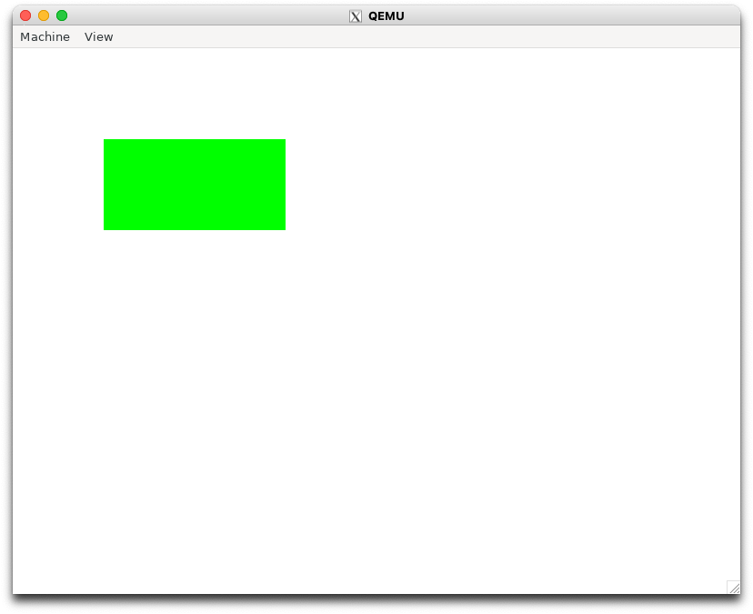
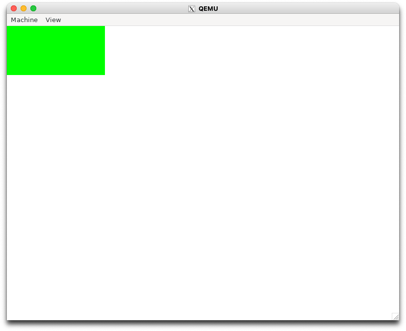

# 4.1 make入門 (osbook_day04a)

```console
$ cd $HOME/workspace/mikanos/kernel
$ git checkout osbook_day04a
$ source $HOME/osbook/devenv/buildenv.sh
```

- LDFLAGS に `-z separete-code` を追加

```diff
diff --git a/kernel/Makefile b/kernel/Makefile
index 2726448..1e1f524 100644
--- a/kernel/Makefile
+++ b/kernel/Makefile
@@ -3,7 +3,7 @@ OBJS = main.o

 CXXFLAGS += -O2 -Wall -g --target=x86_64-elf -ffreestanding -mno-red-zone \
             -fno-exceptions -fno-rtti -std=c++17
-LDFLAGS  += --entry KernelMain -z norelro --image-base 0x100000 --static
+LDFLAGS  += --entry KernelMain -z norelro -z separate-code --image-base 0x100000 --static


 .PHONY: all
```

ビルドし、実行が可能

```
$ make
$ cd $HOME/edk2
$ build
$ $HOME/osbook/devenv/run_qemu.sh Build/MikanLoaderX64/DEBUG_CLANG38/X64/Loader.efi $HOME/workspace/mikanos/kernel/kernel.elf
```

画面は変わらないので省略

# 4.2 ピクセルを自在に描く (osbook_day04b)

```console
$ cd $HOME/workspace/mikanos/kernel
$ git checkout osbook_day04b
$ make
$ $HOME/edk2
$ build
$ $HOME/osbook/devenv/run_qemu.sh Build/MikanLoaderX64/DEBUG_CLANG38/X64/Loader.efi $HOME/workspace/mikanos/kernel/kernel.elf
```



# 4.3 C++ の機能を使って書き直す (osbook_day04c)

```console
$ cd $HOME/workspace/mikanos/kernel
$ git checkout osbook_day04c
$ make
$ cd $HOME/edk2/
$ build
$ $HOME/osbook/devenv/run_qemu.sh Build/MikanLoaderX64/DEBUG_CLANG38/X64/Loader.efi $HOME/workspace/mikanos/kernel/kernel.elf
```



# 4.5 ローダを改良する (osbook_day04d)

```console
$ cd $HOME/workspace/mikanos/kernel/
$ readelf -l kernel.elf

Elf file type is EXEC (Executable file)
Entry point 0x101020
There are 5 program headers, starting at offset 64

Program Headers:
  Type           Offset             VirtAddr           PhysAddr
                 FileSiz            MemSiz              Flags  Align
  PHDR           0x0000000000000040 0x0000000000100040 0x0000000000100040
                 0x0000000000000118 0x0000000000000118  R      0x8
  LOAD           0x0000000000000000 0x0000000000100000 0x0000000000100000
                 0x00000000000001a8 0x00000000000001a8  R      0x1000
  LOAD           0x0000000000001000 0x0000000000101000 0x0000000000101000
                 0x00000000000001c9 0x00000000000001c9  R E    0x1000
  LOAD           0x0000000000002000 0x0000000000102000 0x0000000000102000
                 0x0000000000000000 0x0000000000000018  RW     0x1000
  GNU_STACK      0x0000000000000000 0x0000000000000000 0x0000000000000000
                 0x0000000000000000 0x0000000000000000  RW     0x0

 Section to Segment mapping:
  Segment Sections...
   00
   01     .rodata
   02     .text
   03     .bss
   04
```

```console
$ git checkout osbook_day04d
$ make
$ cd $HOME/edk2/
$ build
$HOME/osbook/devenv/run_qemu.sh Build/MikanLoaderX64/DEBUG_CLANG38/X64/Loader.efi $HOME/workspace/mikanos/kernel/kernel.elf
```

画像は省略
