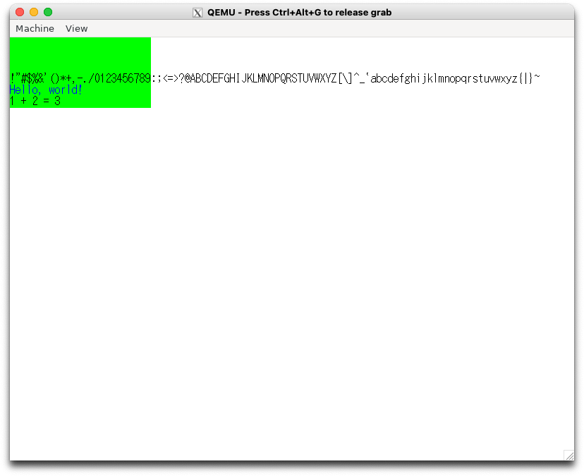

# 5.1 文字を書いてみる(osbook_day05a)

```console
$ cd $HOME/workspace/mikanos/kernel
$ git checkout osbook_day05a
$ cd $HOME/edk2
$ build
$ $HOME/osbook/devenv/run_qemu.sh Build/MikanLoaderX64/DEBUG_CLANG38/X64/Loader.efi $HOME/workspace/mikanos/kernel/kernel.elf
```

# 5.2 分割コンパイル(osbook_day05b)

```console
$ cd $HOME/workspace/mikanos
$ git stash
$ git checkout osbook_day05b
$ git stash pop stash@{0}
```

- 表示は同じなので画像は省略

# 5.3 フォントを増やそう (osbook_day05c)

```console
$ cd $HOME/workspace/mikanos/kernel/
$ git checkout osbook_day05c
$ ../tools/makefont.py -o hankaku.bin hankaku.txt
$ objcopy -I binary -O elf64-x86-64 -B i386:x86-64 hankaku.bin hankaku.o
$ make
$ cd $HOME/edk2
$ build
$ $HOME/osbook/devenv/run_qemu.sh Build/MikanLoaderX64/DEBUG_CLANG38/X64/Loader.efi $HOME/workspace/mikanos/kernel/kernel.elf
```


# 5.4 文字列描画とsprintf() (osbook_day05d)

```console
$ cd $HOME/workspace/mikanos/kernel
$ git checkout -f osbook_day05d
$ make
$ cd $HOME/edk2
$ build
$ $HOME/osbook/devenv/run_qemu.sh Build/MikanLoaderX64/DEBUG_CLANG38/X64/Loader.efi $HOME/workspace/mikanos/kernel/kernel.elf
```


