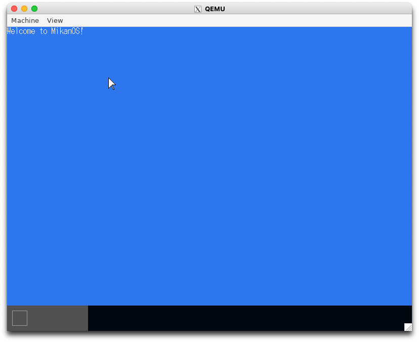
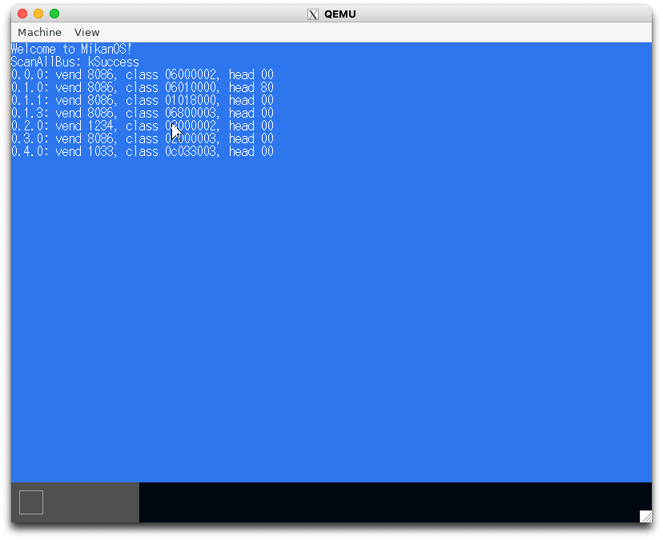
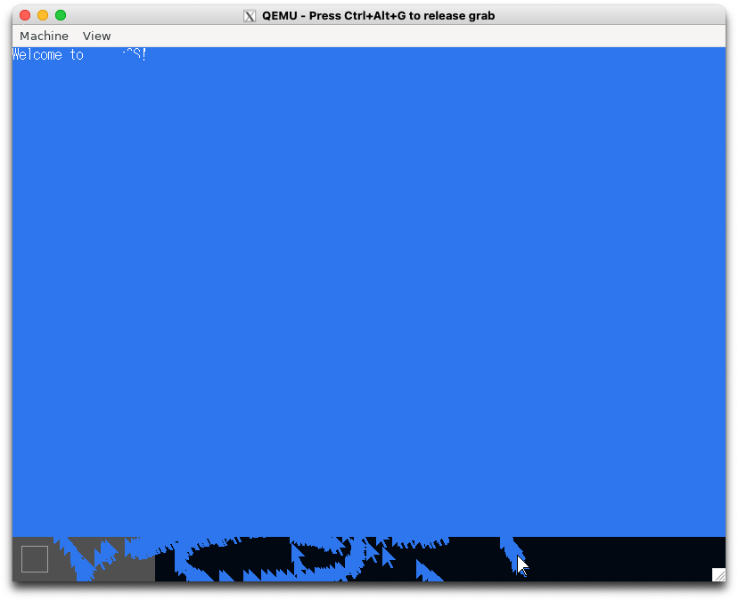

# 6.1 マウスカーソル (osbook_day06a)

```console
$ cd $HOME/workspace/mikanos/kernel
$ git checkout osbook_day06a
$ make
$ cd $HOME/edk2
$ build
$ $HOME/osbook/devenv/run_qemu.sh Build/MikanLoaderX64/DEBUG_CLANG38/X64/Loader.efi $HOME/workspace/mikanos/kernel/kernel.elf
```



# 6.3 PCIデバイスの探索 (osbook_day06b)

```console
$ cd $HOME/workspace/mikanos/kernel
$ git checkout osbook_day06b
$ make
$ cd $HOME/edk2
$ build
$ $HOME/osbook/devenv/run_qemu.sh Build/MikanLoaderX64/DEBUG_CLANG38/X64/Loader.efi $HOME/workspace/mikanos/kernel/kernel.elf
```



# 6.4 ポーリングでマウス入力 (osbook_day06c)

```console
$ cd $HOME/workspace/mikanos/kernel
$ git checkout osbook_day06c
$ make
$ cd $HOME/edk2
$ build
$ $HOME/osbook/devenv/run_qemu.sh Build/MikanLoaderX64/DEBUG_CLANG38/X64/Loader.efi $HOME/workspace/mikanos/kernel/kernel.elf
```


