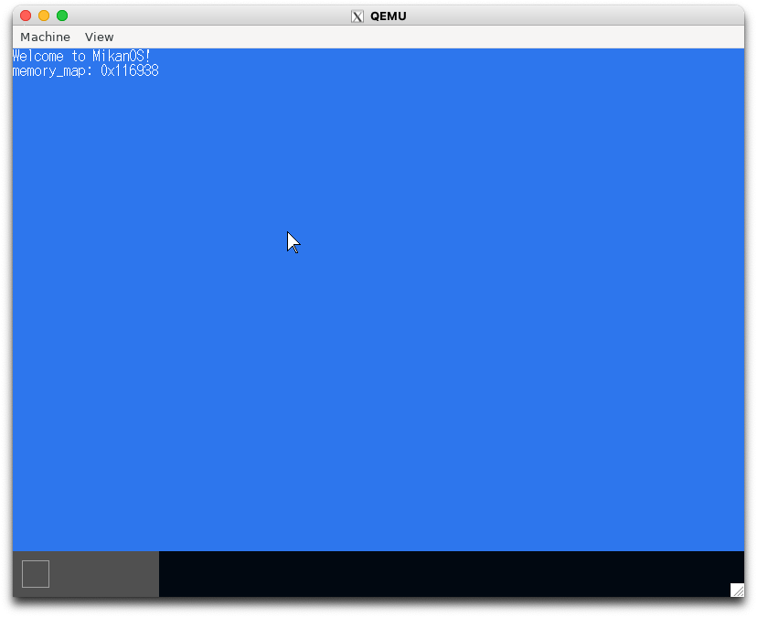

# 8.2 UEFI メモリマップ(osbook_day08a)

```console
$ cd $HOME/workspace/mikanos/kernel
$ git checkout osbook_day08a
$ make
$ cd $HOME/edk2
$ build
$ $HOME/osbook/devenv/run_qemu.sh Build/MikanLoaderX64/DEBUG_CLANG38/X64/Loader.efi $HOME/workspace/mikanos/kernel/kernel.elf
```



# 8.3 データ構造の移動(osbook_day08b)


```console
$ cd $HOME/workspace/mikanos/kernel
$ git checkout osbook_day08b
$ make
$ cd $HOME/edk2
$ build
$ $HOME/osbook/devenv/run_qemu.sh Build/MikanLoaderX64/DEBUG_CLANG38/X64/Loader.efi $HOME/workspace/mikanos/kernel/kernel.elf
```

画面は変わらないので省略

# 8.7 メモリ管理に挑戦(osbook_day08c)

```console
$ cd $HOME/workspace/mikanos/kernel
$ git checkout osbook_day08c
$ make
$ cd $HOME/edk2
$ build
$ $HOME/osbook/devenv/run_qemu.sh Build/MikanLoaderX64/DEBUG_CLANG38/X64/Loader.efi $HOME/workspace/mikanos/kernel/kernel.elf
```

画面は変わらないので省略
