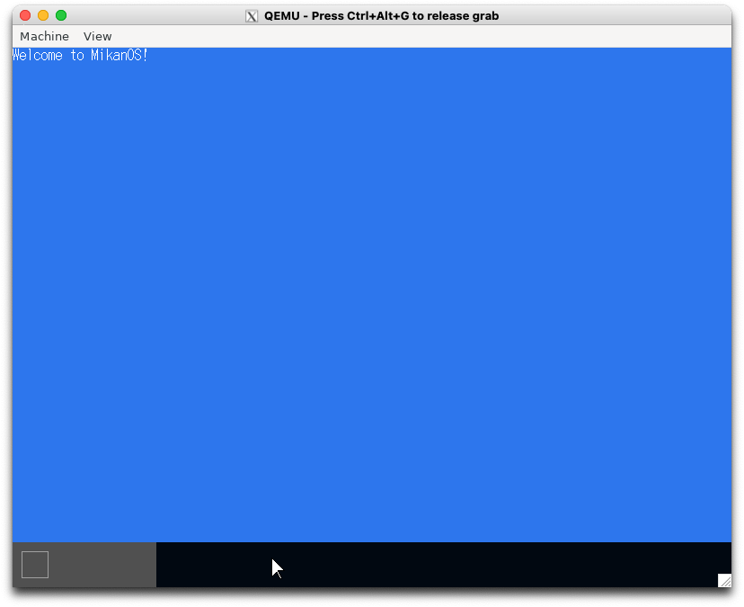
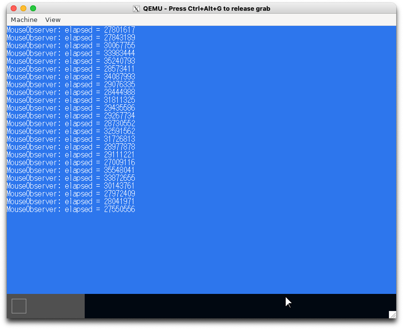

# 9.1 重ね合わせ処理(osbook_day09a)

```console
$ cd $HOME/workspace/mikanos/kernel
$ git checkout osbook_day09a
$ make
$ cd $HOME/edk2
$ build
$ $HOME/osbook/devenv/run_qemu.sh Build/MikanLoaderX64/DEBUG_CLANG38/X64/Loader.efi $HOME/workspace/mikanos/kernel/kernel.elf
```



# 9.4 重ね合わせ処理の時間計測(osbook_day09b)

```console
$ cd $HOME/workspace/mikanos/kernel
$ git checkout osbook_day09a
$ make
$ cd $HOME/edk2
$ build
$ $HOME/osbook/devenv/run_qemu.sh Build/MikanLoaderX64/DEBUG_CLANG38/X64/Loader.efi $HOME/workspace/mikanos/kernel/kernel.elf
```


