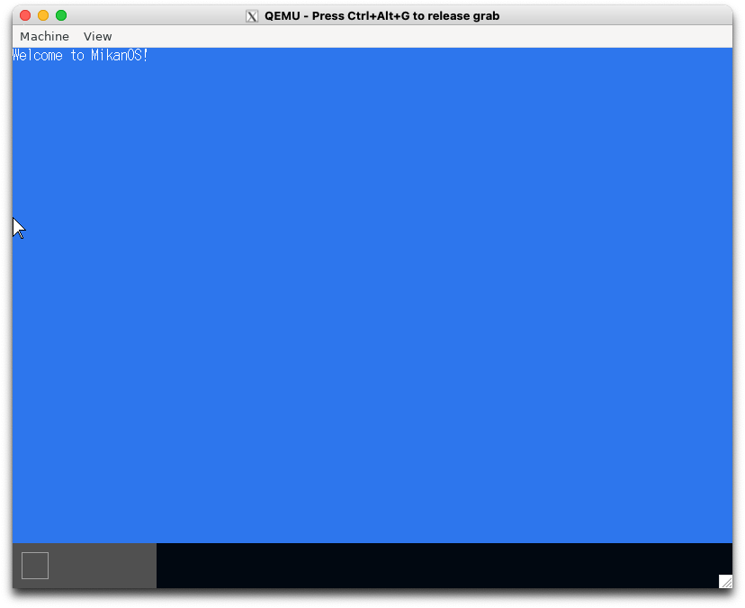
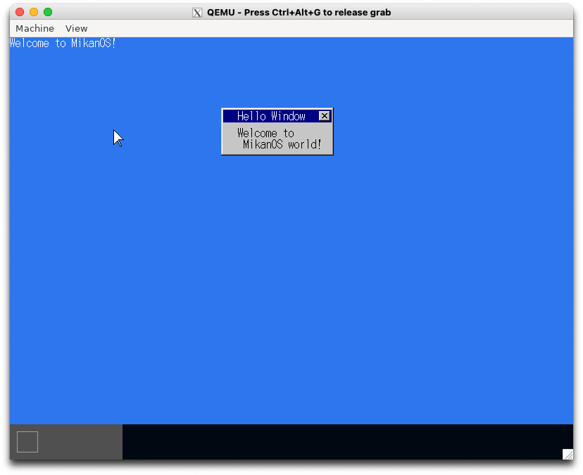
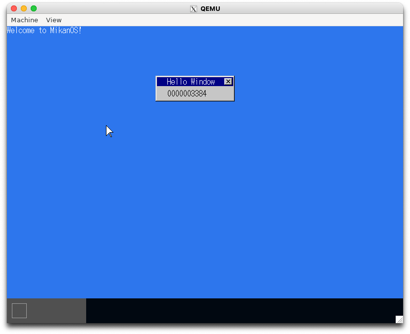

# 10.1 もっとマウス (osbook_day10a)

```console
$ cd $HOME/workspace/mikanos/kernel
$ git checkout osbook_day10a
$ make
$ cd $HOME/edk2
$ build
$ $HOME/osbook/devenv/run_qemu.sh Build/MikanLoaderX64/DEBUG_CLANG38/X64/Loader.efi $HOME/workspace/mikanos/kernel/kernel.elf
```



# 10.2 もっとマウス (osbook_day10b)

```console
$ cd $HOME/workspace/mikanos/kernel
$ git checkout osbook_day10b
$ make
$ cd $HOME/edk2
$ build
$ $HOME/osbook/devenv/run_qemu.sh Build/MikanLoaderX64/DEBUG_CLANG38/X64/Loader.efi $HOME/workspace/mikanos/kernel/kernel.elf
```



# 10.3 高速カウンタ (osbook_day010c)

```console
$ cd $HOME/workspace/mikanos/kernel
$ git checkout osbook_day10c
$ make
$ cd $HOME/edk2
$ build
$ $HOME/osbook/devenv/run_qemu.sh Build/MikanLoaderX64/DEBUG_CLANG38/X64/Loader.efi $HOME/workspace/mikanos/kernel/kernel.elf
```



# 10.4 チラチラ解消 (osbook_day010d)

```console
$ cd $HOME/workspace/mikanos/kernel
$ git checkout osbook_day10d
$ make
$ cd $HOME/edk2
$ build
$ $HOME/osbook/devenv/run_qemu.sh Build/MikanLoaderX64/DEBUG_CLANG38/X64/Loader.efi $HOME/workspace/mikanos/kernel/kernel.elf
```


