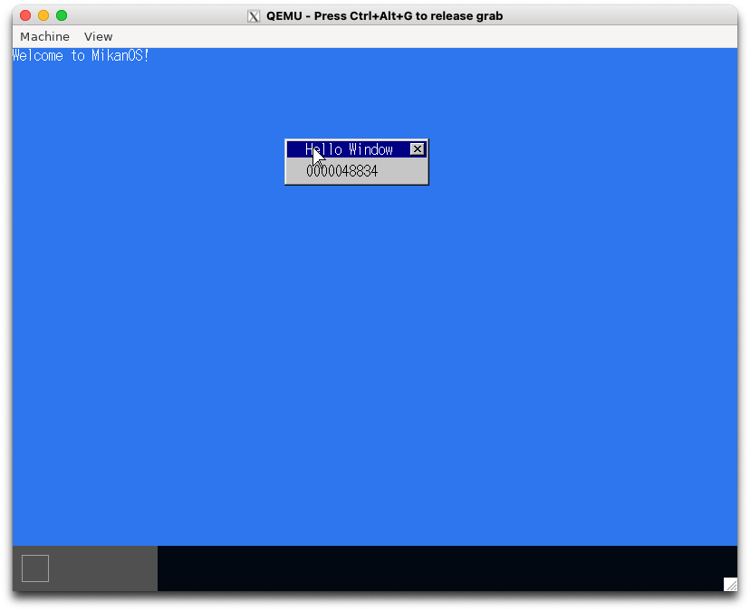
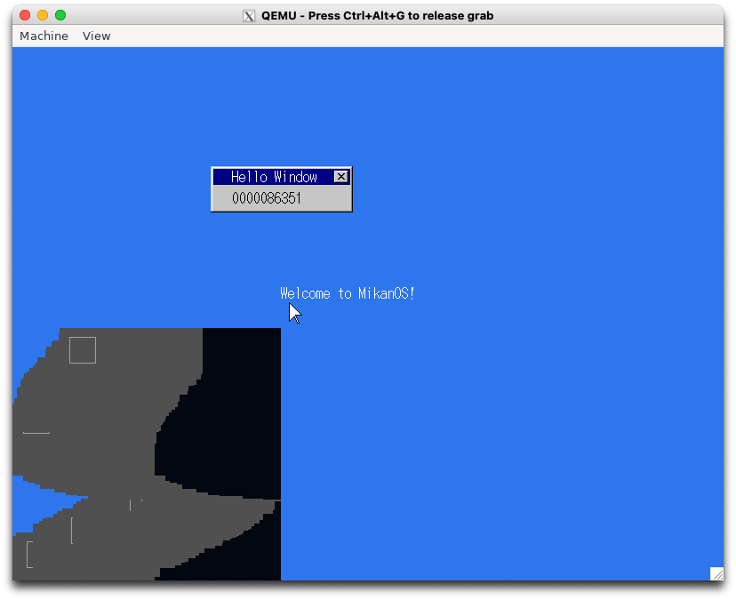
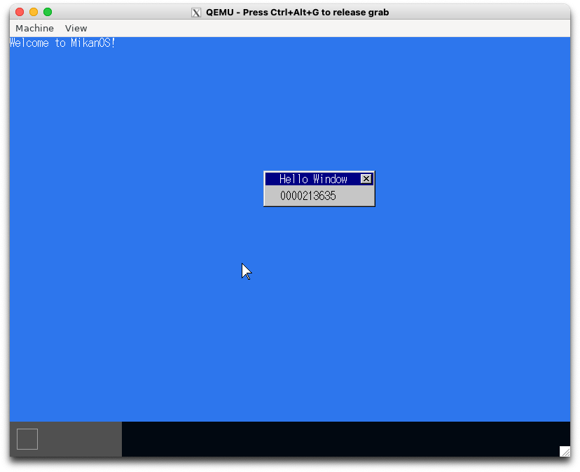

# 10.1 もっとマウス (osbook_day10a)

```console
$ cd $HOME/workspace/mikanos/kernel
$ git checkout osbook_day10a
$ make
$ cd $HOME/edk2
$ build
$ $HOME/osbook/devenv/run_qemu.sh Build/MikanLoaderX64/DEBUG_CLANG38/X64/Loader.efi $HOME/workspace/mikanos/kernel/kernel.elf
```


# 10.2 もっとマウス (osbook_day10b)

```console
$ cd $HOME/workspace/mikanos/kernel
$ git checkout osbook_day10b
$ make
$ cd $HOME/edk2
$ build
$ $HOME/osbook/devenv/run_qemu.sh Build/MikanLoaderX64/DEBUG_CLANG38/X64/Loader.efi $HOME/workspace/mikanos/kernel/kernel.elf
```


# 10.3 高速カウンタ (osbook_day010c)

```console
$ cd $HOME/workspace/mikanos/kernel
$ git checkout osbook_day10c
$ make
$ cd $HOME/edk2
$ build
$ $HOME/osbook/devenv/run_qemu.sh Build/MikanLoaderX64/DEBUG_CLANG38/X64/Loader.efi $HOME/workspace/mikanos/kernel/kernel.elf
```


# 10.4 チラチラ解消 (osbook_day010d)

```console
$ cd $HOME/workspace/mikanos/kernel
$ git checkout osbook_day10d
$ make
$ cd $HOME/edk2
$ build
$ $HOME/osbook/devenv/run_qemu.sh Build/MikanLoaderX64/DEBUG_CLANG38/X64/Loader.efi $HOME/workspace/mikanos/kernel/kernel.elf
```


# 10.5 バックバッファ (osbook_day010e)

```console
$ cd $HOME/workspace/mikanos/kernel
$ git checkout osbook_day10e
$ make
$ cd $HOME/edk2
$ build
$ $HOME/osbook/devenv/run_qemu.sh Build/MikanLoaderX64/DEBUG_CLANG38/X64/Loader.efi $HOME/workspace/mikanos/kernel/kernel.elf
```



# 10.6 ウィンドウのドラッグ移動 (osbook_day10f)


```console
$ cd $HOME/workspace/mikanos/kernel
$ git checkout osbook_day10f
$ make
```

- エラーが出る。

```console
ld.lld: error: undefined symbol: usb::HIDMouseDriver::SubscribeMouseMove(std::__1::function<void (signed char, signed char)>)
>>> referenced by device.cpp:68 (/home/vscode/workspace/mikanos/kernel/usb/device.cpp:68)
>>>               usb/device.o:(usb::Device::InitializePhase2(unsigned char const*, int))
>>> did you mean: usb::HIDMouseDriver::SubscribeMouseMove(std::__1::function<void (unsigned char, signed char, signed char)>)
>>> defined in: usb/classdriver/mouse.o
make: *** [Makefile:26: kernel.elf] Error 1
```

修正

```
diff --git a/kernel/usb/classdriver/mouse.cpp b/kernel/usb/classdriver/mouse.cpp
index 95f1d13..7327f98 100644
--- a/kernel/usb/classdriver/mouse.cpp
+++ b/kernel/usb/classdriver/mouse.cpp
@@ -31,7 +31,8 @@ namespace usb {
     observers_[num_observers_++] = observer;
   }

-  std::function<HIDMouseDriver::ObserverType> HIDMouseDriver::default_observer;
+  std::function<HIDMouseDriver::ObserverType> HIDMouseDriver::default_observer =
+    [](uint8_t, int8_t, int8_t) {};

   void HIDMouseDriver::NotifyMouseMove(
       uint8_t buttons, int8_t displacement_x, int8_t displacement_y) {
diff --git a/kernel/usb/device.cpp b/kernel/usb/device.cpp
index 1dda2b9..f38c5ac 100644
--- a/kernel/usb/device.cpp
+++ b/kernel/usb/device.cpp
@@ -65,7 +65,8 @@ namespace {
       } else if (if_desc.interface_protocol == 2) {  // mouse
         auto mouse_driver = new usb::HIDMouseDriver{dev, if_desc.interface_number};
         if (usb::HIDMouseDriver::default_observer) {
-          mouse_driver->SubscribeMouseMove(usb::HIDMouseDriver::default_observer);
+         mouse_driver->SubscribeMouseMove(
+  static_cast<std::function<usb::HIDMouseDriver::ObserverType>>(usb::HIDMouseDriver::default_observer));
         }
         return mouse_driver;
       }
```

```console
$ make
$ cd $HOME/edk2
$ build
$ $HOME/osbook/devenv/run_qemu.sh Build/MikanLoaderX64/DEBUG_CLANG38/X64/Loader.efi $HOME/workspace/mikanos/kernel/kernel.elf
```



# 10.7 ウィンドウだけドラッグ移動 (osbook_day10g)

```console
$ cd $HOME/workspace/mikanos/kernel
$ git checkout osbook_day10g
$ make
$ cd $HOME/edk2
$ build
$ $HOME/osbook/devenv/run_qemu.sh Build/MikanLoaderX64/DEBUG_CLANG38/X64/Loader.efi $HOME/workspace/mikanos/kernel/kernel.elf
```


