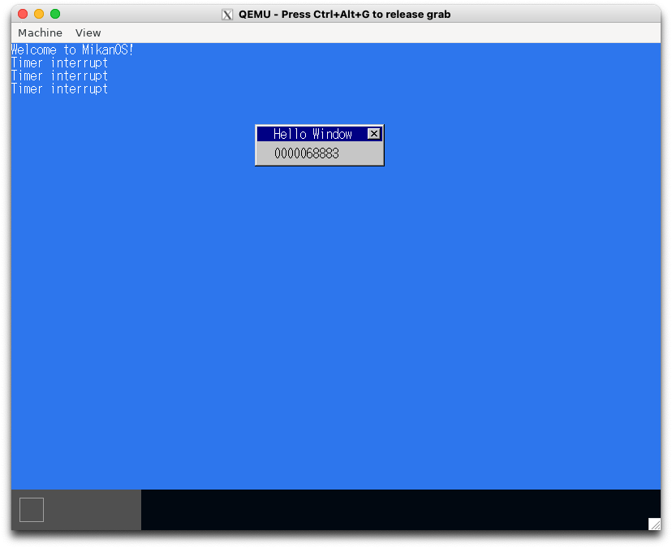
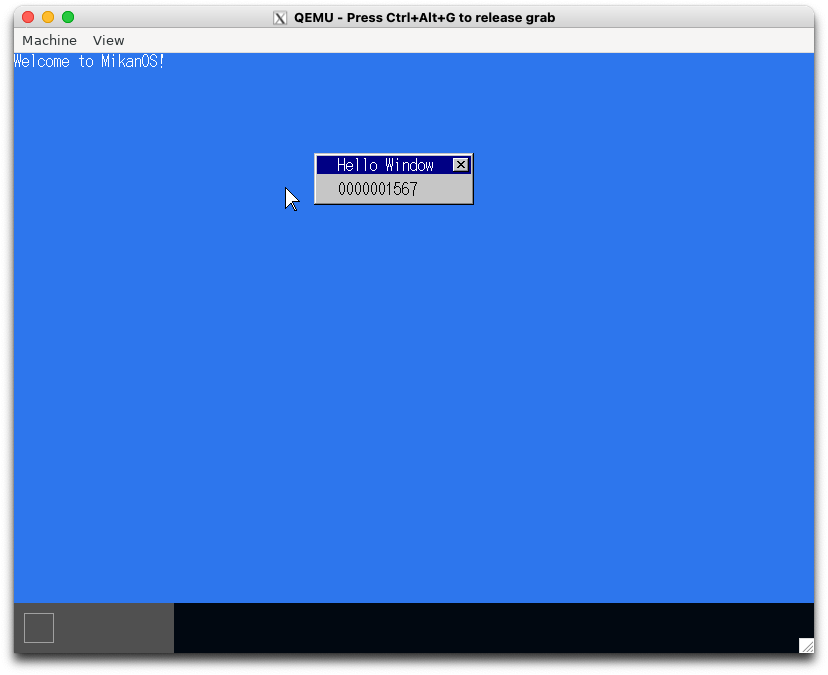
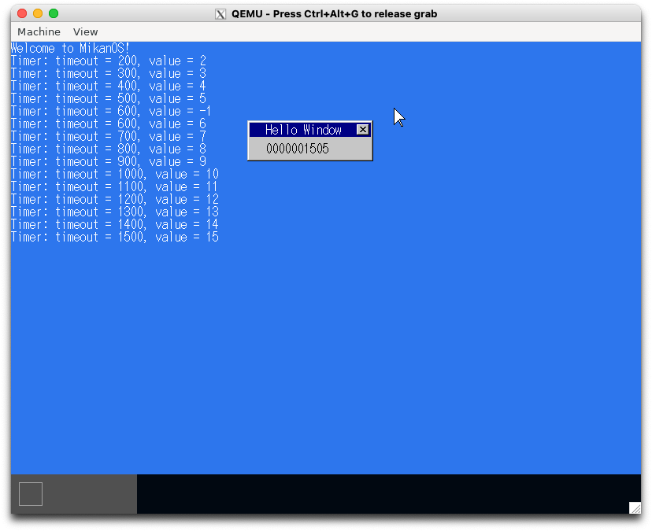

# 11.1 ソースコード整理 (osbook_day11a)

```console
$ cd $HOME/workspace/mikanos/kernel
$ git checkout osbook_day11a
$ make
$ cd $HOME/edk2
$ build
$ $HOME/osbook/devenv/run_qemu.sh Build/MikanLoaderX64/DEBUG_CLANG38/X64/Loader.efi $HOME/workspace/mikanos/kernel/kernel.elf
```

画面は変わらないので省略

# 11.2 タイマ割り込み (osbook_day11b)

```console
$ cd $HOME/workspace/mikanos/kernel
$ git checkout osbook_day11b
$ make
$ cd $HOME/edk2
$ build
$ $HOME/osbook/devenv/run_qemu.sh Build/MikanLoaderX64/DEBUG_CLANG38/X64/Loader.efi $HOME/workspace/mikanos/kernel/kernel.elf
```



# 11.3 細かく時間を計る (osbook_day11c)

```console
$ cd $HOME/workspace/mikanos/kernel
$ git checkout osbook_day11c
$ make
$ cd $HOME/edk2
$ build
$ $HOME/osbook/devenv/run_qemu.sh Build/MikanLoaderX64/DEBUG_CLANG38/X64/Loader.efi $HOME/workspace/mikanos/kernel/kernel.elf
```



# 11.4 複数のタイマとタイムアウト通知 (osbook_day11d)

```console
$ cd $HOME/workspace/mikanos/kernel
$ git checkout osbook_day11d
$ make
$ cd $HOME/edk2
$ build
$ $HOME/osbook/devenv/run_qemu.sh Build/MikanLoaderX64/DEBUG_CLANG38/X64/Loader.efi $HOME/workspace/mikanos/kernel/kernel.elf
```



# 11.5 ACPI PMタイマとRSDP (osbook_day11e)

```console
$ cd $HOME/workspace/mikanos/kernel
$ git checkout osbook_day11e
$ make
$ cd $HOME/edk2
$ build
$ $HOME/osbook/devenv/run_qemu.sh Build/MikanLoaderX64/DEBUG_CLANG38/X64/Loader.efi $HOME/workspace/mikanos/kernel/kernel.elf
```

画面は変わらないので省略
