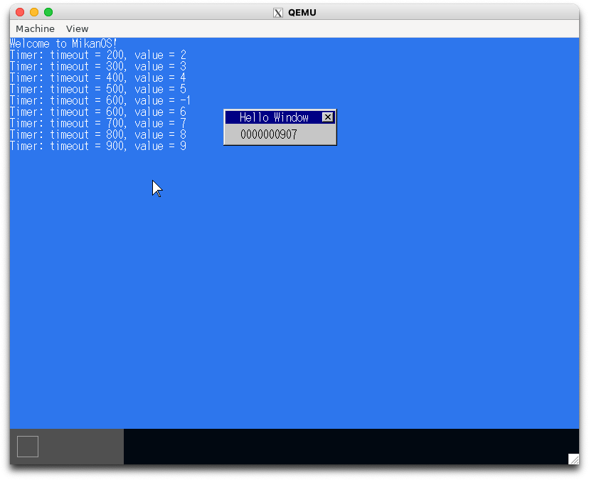
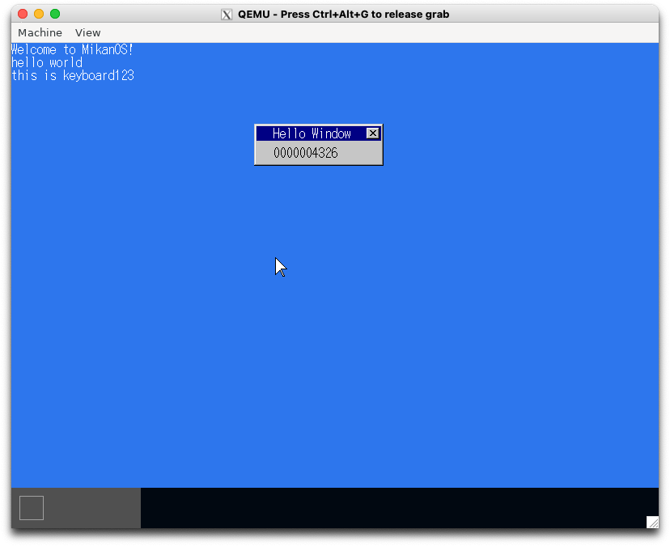

# 12.1 FADT を探す (osbook_day12a)

```console
$ cd $HOME/workspace/mikanos/kernel
$ git checkout osbook_day12a
$ make
$ cd $HOME/edk2
$ build
$ $HOME/osbook/devenv/run_qemu.sh Build/MikanLoaderX64/DEBUG_CLANG38/X64/Loader.efi $HOME/workspace/mikanos/kernel/kernel.elf
```

画面は変わらないので省略

# 12.2 ACPI PM タイマを使う (osbook_day12b)

```console
$ cd $HOME/workspace/mikanos/kernel
$ git checkout osbook_day12b
$ make
$ cd $HOME/edk2
$ build
$ $HOME/osbook/devenv/run_qemu.sh Build/MikanLoaderX64/DEBUG_CLANG38/X64/Loader.efi $HOME/workspace/mikanos/kernel/kernel.elf
```



# 12.3 (osbook_day12c)

```console
$ cd $HOME/workspace/mikanos/kernel
$ git checkout osbook_day12c
$ make
$ cd $HOME/edk2
$ build
$ $HOME/osbook/devenv/run_qemu.sh Build/MikanLoaderX64/DEBUG_CLANG38/X64/Loader.efi $HOME/workspace/mikanos/kernel/kernel.elf
```


