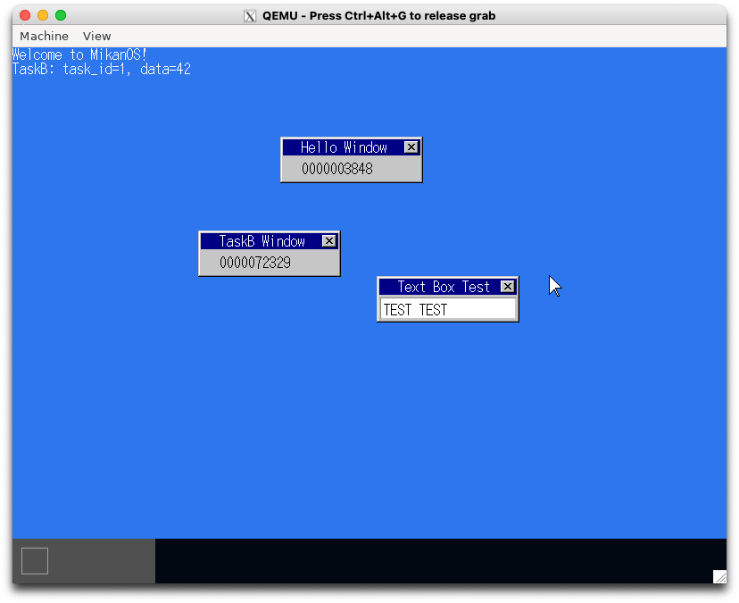

# 13.2 コンテキストの切り替えに挑戦 (sobook_day13a)

```console
$ cd $HOME/workspace/mikanos/kernel
$ git checkout osbook_day13a
$ make
$ cd $HOME/edk2
$ build
$ $HOME/osbook/devenv/run_qemu.sh Build/MikanLoaderX64/DEBUG_CLANG38/X64/Loader.efi $HOME/workspace/mikanos/kernel/kernel.elf
```


