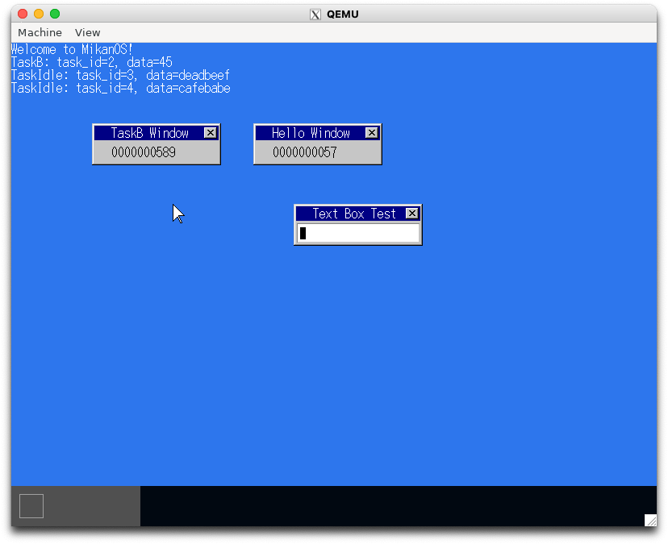

# 14.1 スリープしてみる (osbook_day14a)

```console
$ cd $HOME/workspace/mikanos/kernel
$ git checkout osbook_day14a
$ make
$ cd $HOME/edk2
$ build
$ $HOME/osbook/devenv/run_qemu.sh Build/MikanLoaderX64/DEBUG_CLANG38/X64/Loader.efi $HOME/workspace/mikanos/kernel/kernel.elf
```



# 14.2 イベントが来たら起床する (osbook_day14b)

```console
$ cd $HOME/workspace/mikanos/kernel
$ git checkout osbook_day14b
$ make
$ cd $HOME/edk2
$ build
$ $HOME/osbook/devenv/run_qemu.sh Build/MikanLoaderX64/DEBUG_CLANG38/X64/Loader.efi $HOME/workspace/mikanos/kernel/kernel.elf
```

画像は省略

# 14.4 タスクに優先度を付ける (osbook_day14c)

```console
$ cd $HOME/workspace/mikanos/kernel
$ git checkout osbook_day14c
$ make
$ cd $HOME/edk2
$ build
$ $HOME/osbook/devenv/run_qemu.sh Build/MikanLoaderX64/DEBUG_CLANG38/X64/Loader.efi $HOME/workspace/mikanos/kernel/kernel.elf
```

画像は省略

# 14.5 アイドルタスク (osbook_day14d)

```console
$ cd $HOME/workspace/mikanos/kernel
$ git checkout osbook_day14d
$ make
$ cd $HOME/edk2
$ build
$ $HOME/osbook/devenv/run_qemu.sh Build/MikanLoaderX64/DEBUG_CLANG38/X64/Loader.efi $HOME/workspace/mikanos/kernel/kernel.elf
```

画像は省略
