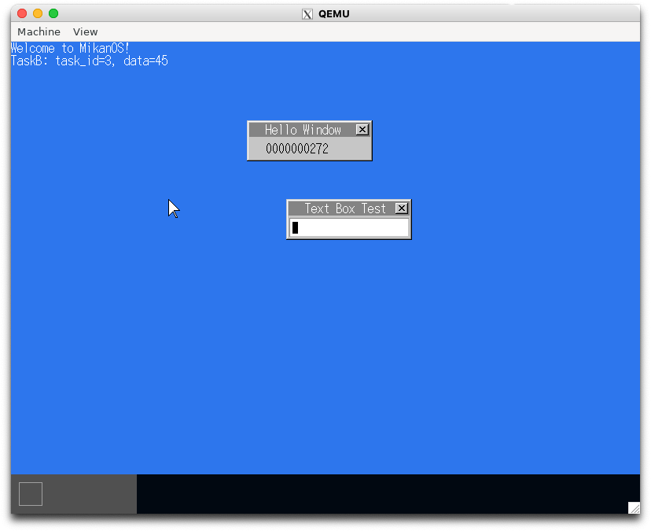
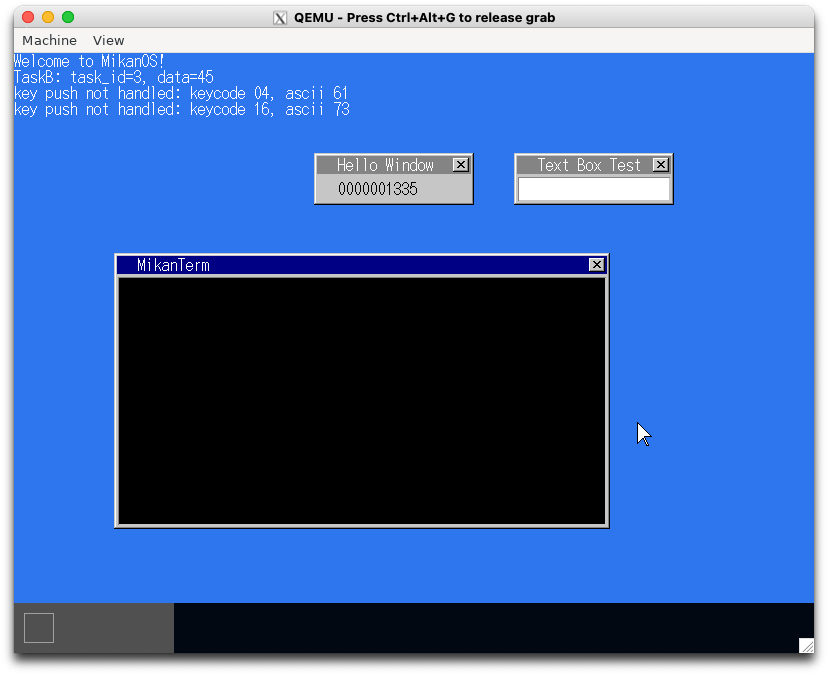
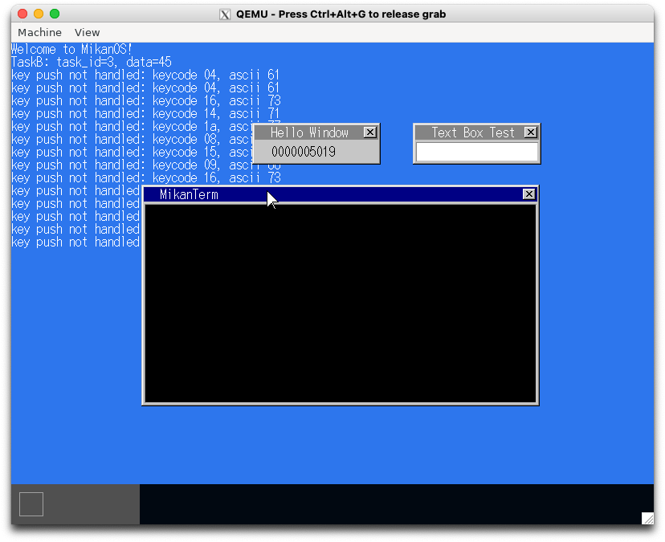

# 15.1 ウィンドウ描画はメインスレッドで (osbook_day15a)

```console
$ cd $HOME/workspace/mikanos/kernel
$ git checkout osbook_day15a
$ make
$ cd $HOME/edk2
$ build
$ $HOME/osbook/devenv/run_qemu.sh Build/MikanLoaderX64/DEBUG_CLANG38/X64/Loader.efi $HOME/workspace/mikanos/kernel/kernel.elf
```

画像は省略

# 15.2 アクティブウィンドウ (osbook_day15b)

```console
$ cd $HOME/workspace/mikanos/kernel
$ git checkout osbook_day15b
$ make
$ cd $HOME/edk2
$ build
$ $HOME/osbook/devenv/run_qemu.sh Build/MikanLoaderX64/DEBUG_CLANG38/X64/Loader.efi $HOME/workspace/mikanos/kernel/kernel.elf
```



# 15.3 ターミナルウィンドウ (osbook_day15c)

```console
$ cd $HOME/workspace/mikanos/kernel
$ git checkout osbook_day15c
$ make
$ cd $HOME/edk2
$ build
$ $HOME/osbook/devenv/run_qemu.sh Build/MikanLoaderX64/DEBUG_CLANG38/X64/Loader.efi $HOME/workspace/mikanos/kernel/kernel.elf
```



# 15.4 描画の高速化　（osbook_day15d）

```console
$ cd $HOME/workspace/mikanos/kernel
$ git checkout osbook_day15d
$ make
$ cd $HOME/edk2
$ build
$ $HOME/osbook/devenv/run_qemu.sh Build/MikanLoaderX64/DEBUG_CLANG38/X64/Loader.efi $HOME/workspace/mikanos/kernel/kernel.elf
```


