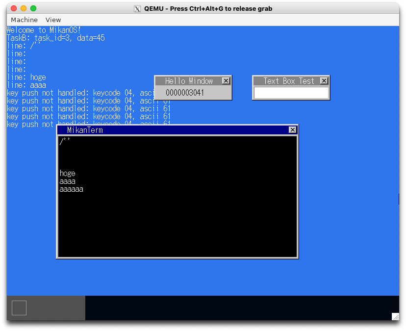

# 16.1 ターミナルでキー入力 (osbook_day16a)

```console
$ cd $HOME/workspace/mikanos/kernel
$ git checkout osbook_day16a
$ make
$ cd $HOME/edk2
$ build
$ $HOME/osbook/devenv/run_qemu.sh Build/MikanLoaderX64/DEBUG_CLANG38/X64/Loader.efi $HOME/workspace/mikanos/kernel/kernel.elf
```



# 16.2 echo コマンド (osbook_day16b)

```console
$ cd $HOME/workspace/mikanos/kernel
$ git checkout osbook_day16b
$ make
$ cd $HOME/edk2
$ build
$ $HOME/osbook/devenv/run_qemu.sh Build/MikanLoaderX64/DEBUG_CLANG38/X64/Loader.efi $HOME/workspace/mikanos/kernel/kernel.elf
```


