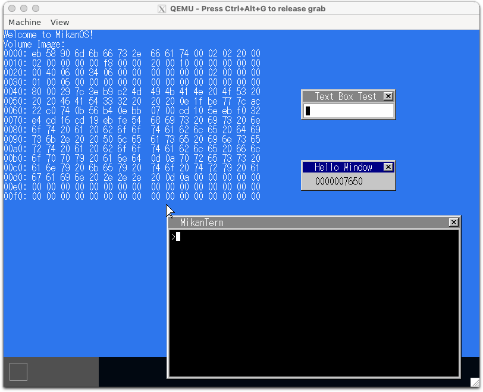
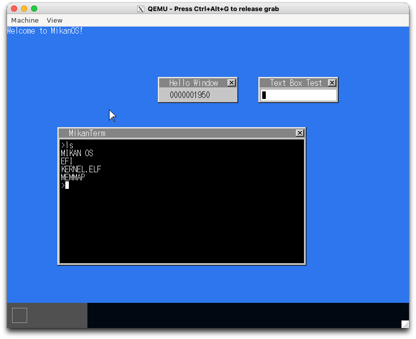

# 17.4 ボリュームを読み出す (osbook_day17a)

```console
$ cd $HOME/workspace/mikanos/kernel
$ git checkout osbook_day17a
$ make
$ cd $HOME/edk2
$ build
$ $HOME/osbook/devenv/run_qemu.sh Build/MikanLoaderX64/DEBUG_CLANG38/X64/Loader.efi $HOME/workspace/mikanos/kernel/kernel.elf
```

ここから起動がめちゃ遅くなった



# 17.5 ls コマンド (osbook_day17b)

```console
$ cd $HOME/workspace/mikanos/kernel
$ git checkout osbook_day17b
$ make
$ cd $HOME/edk2
$ build
$ $HOME/osbook/devenv/run_qemu.sh Build/MikanLoaderX64/DEBUG_CLANG38/X64/Loader.efi $HOME/workspace/mikanos/kernel/kernel.elf
```

描画が遅い時は xQuartz のウィンドウ右下をドラッグして、ウィンドウサイズをいじるとすぐ描画されるかも？


