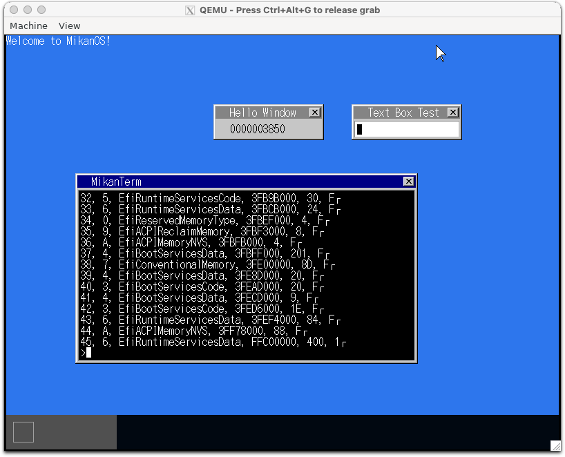
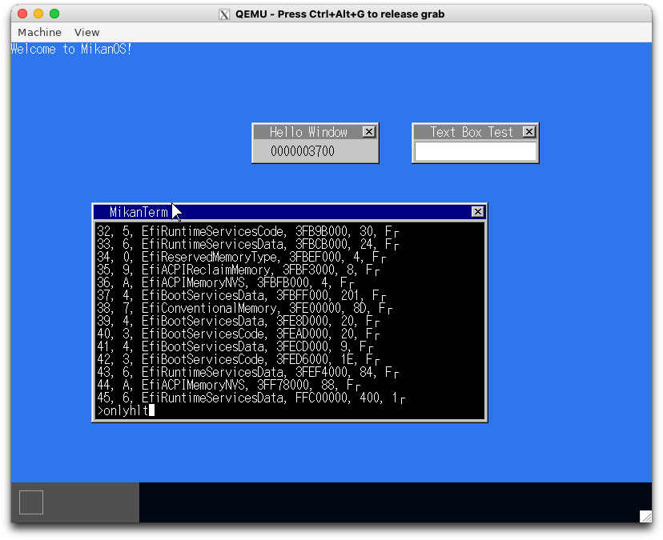

# 18.1 ファイルアロケーションテーブル (osbook_day18a)

```console
$ cd $HOME/workspace/mikanos/kernel
$ git checkout osbook_day18a
$ make
$ cd $HOME/edk2
$ build
$ $HOME/osbook/devenv/run_qemu.sh Build/MikanLoaderX64/DEBUG_CLANG38/X64/Loader.efi $HOME/workspace/mikanos/kernel/kernel.elf
```



# 18.2 初アプリ (osbook_day18b)

```console
$ cd $HOME/workspace/mikanos/kernel
$ git checkout osbook_day18b
$ cd apps/onlyhlt
$ make
nasm -f bin -o onlyhlt onlyhlt.asm
$ xxd onlyhlt
00000000: f4eb fd                                  ...
$ objdump -D -m i386:x86-64 -b binary onlyhlt

onlyhlt:     file format binary


Disassembly of section .data:

0000000000000000 <.data>:
   0:   f4                      hlt
   1:   eb fd                   jmp    0x0
```

```console
./build.sh run
```



# 18.3 C++で計算機 (osbook_day18c)

```console
./build.sh run
```

rpn コマンドを実行すると終了してしまう。う〜む。
